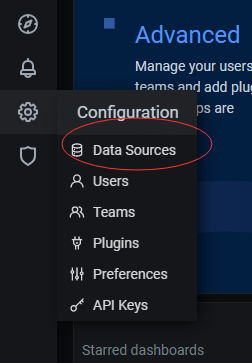
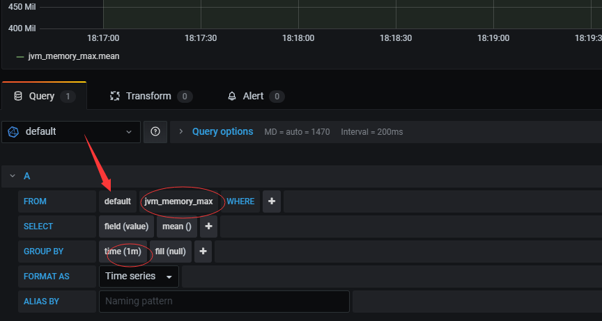
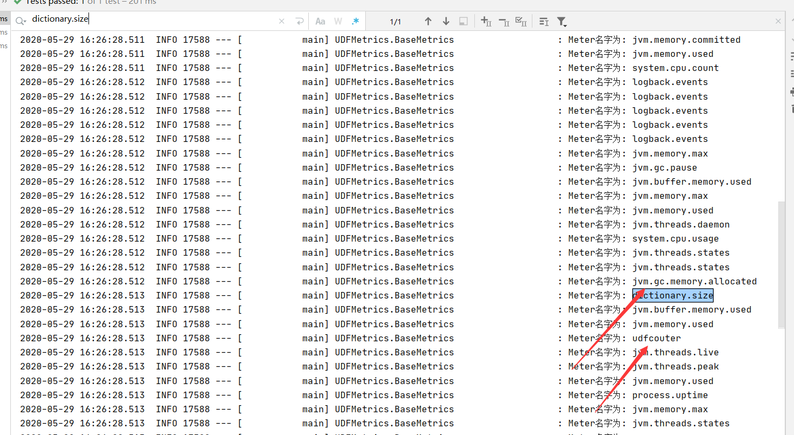
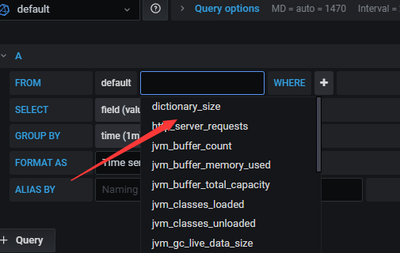

# actuator主要是做监控
[一个英文教程](https://www.bilibili.com/video/BV1RC4y1p7wN?from=search&seid=15101619264676272548)
# EndPoint管理    

如果你是用IDEA商业版，你将可以看到SpringBoot暴露出的EndPoint的Http地址。详细不做介绍了，反正就是可以通过Http暴露监控信息。但是这样做的场景并不多。
# Metrics 
Java常用的Metrics库
* [dropwizard/metrics](https://github.com/dropwizard/metrics) ,Flink Samza等大数据处理框架中所使用的Metrics库。
* [micrometer-metrics](https://github.com/micrometer-metrics/micrometer), SpringBoot2中所使用的Metrics库，只有接口没有实现，类比如Sl4j框架。


## docker 环境
1. docker安装 influxDb
```text
docker run -d --name influx -p 8086:8086 influxdb
```
2. docker安装Grafana
```text
docker run -d --name=grafana -p 3000:3000 grafana/grafana
```
3. docker 安装Prometheus
```text
docker run --name prometheus -d -p 9090:9090 prom/prometheus
```
>> SpringBoot 开箱即用的 InfluxDb（免费，性能高，没有分布式，push模式）和Prometheus（功能多，可分布式，pull模型）。DataDog,New Relic是需要收费的。Graphite太丑了。WaveFront没找到资料
## 禁用SpringBoot Actuator中Http监控，JMX监控。
```yaml
management:
  #JMX
  endpoints:
    jmx:
      exposure:
        exclude: '*'
  #Http
  server:
    port: -1
```
## InfluxDb + Grafana Metrics 监控
pom
```xml
      <dependency>
            <groupId>org.springframework.boot</groupId>
            <artifactId>spring-boot-starter-actuator</artifactId>
        </dependency>
        <dependency>
            <groupId>io.micrometer</groupId>
            <artifactId>micrometer-registry-influx</artifactId>
            <scope>runtime</scope>
        </dependency>
```
yml
```yaml
management:
  metrics:
    export:
      influx:
        auto-create-db: true
        db: test
        uri: http://192.168.15.102:8086
        connect-timeout: 1s
        read-timeout: 10s
        num-threads: 1
        consistency: one
        compressed: true
        batch-size: 10000
        enabled: true
        step: 1m
      prometheus:
        enabled: false
```
grafana 简单步骤 搞个数据源 -> 搞个图表 -> 写好对应Sql —> 结果渲染  



## 自定义Metrics，并在Grafana中监控
第一种：实现 MeterBinder 接口，Spring将会自动装配
```java
/**
 * @author tongjian
 * @date 2020/5/28 18:26
 */
@Component
public class UDFMetrics implements MeterBinder {
    AtomicInteger atomicInteger = new AtomicInteger(0);

    @Override
    public void bindTo(MeterRegistry meterRegistry) {
        Gauge.builder("udfcouter", atomicInteger, c -> c.incrementAndGet())
                .tag("host", "localhost")
                .description("自定义metrcis")
                .register(meterRegistry);
    }
}
```
第二种：通过构造函数，注册中心绑定。 使用@Component 或 @Service 等IOC容器注解，SpringBoot将会自动装配
```java
/**
 * @author maodun
 * @date 2020/5/29 15:27
 */
@Component
public class RegistryBind {
    private final List<String> words = new CopyOnWriteArrayList<>();

    public RegistryBind(MeterRegistry registry) {
        registry.gaugeCollectionSize("dictionary.size", Tags.empty(), this.words);
    }
}

```
第三种，通过@Bean 注解装配IOC容器。
```java
/**
 * @author maodun
 * @date 2020/5/29 15:31
 */
@Configuration
public class MetricsConf {
    @Bean
    public Counter udfCounter() {
        return Metrics.globalRegistry.counter("testCounter", Tags.empty());
    }
}

```
在IOC容器中使用
```java
/**
 * @author maodun
 * @date 2020/5/29 15:36
 */
@Component
public class MetricsBean {
    private final Counter counter;

    public MetricsBean(MeterRegistry registry) {
        RequiredSearch testcounter = registry.get("testCounter");
        this.counter = testcounter.counter();
    }

    public void handleMessage(String message) {
        this.counter.increment();
        // handle message implementation
    }
}
```
### 单元测试
首先我们看下SpringBoot已有的 Metrics Meter （JVM，Http，Tomcat）, 代码在UDFMetrcis目录下。UDFMetrics.BaseMetrics.java
```java
/**
 * @author tongjian
 * @date 2020/5/29 15:49
 */
@SpringBootTest(classes = InfluxApp.class, args = "--spring.profiles.active=influx")
@Slf4j
public class BaseMetrics {
    private static final AtomicInteger registrySize = new AtomicInteger(0);
    private static final AtomicInteger meterSize = new AtomicInteger(0);

    @Test
    void allMetrics() {
        for (MeterRegistry registry : Metrics.globalRegistry.getRegistries()) {
            registrySize.incrementAndGet();
            log.info("Registry Name is: {}", registry.config().toString());
            for (Meter meter : registry.getMeters()) {
                meterSize.incrementAndGet();
                log.info("Meter名字为: {} ", meter.getId().getName());
            }
        }
        log.info("注册中心数量为: {}，Metrics 仪表数为: {}", registrySize.get(), meterSize.get());
    }
}
```
  
  
自定义的Metrics都注册入了注册中心，并且输出到了InfluxDb。 下面我来学习如果使用一个自定义的Metrics。UDFMetrics.UDFMetricsUse.java


### grafana 告警
TODO

## Prometheus + Grafana Metrics监控SpringBoot
TODO
## Timed注解
TODO

# 参考
[SpringBoot监控对比](https://hacpai.com/article/1577185696409)  
[SpringBoot整合InfluxDb](https://www.dazhuanlan.com/2019/08/17/5d5774af8c8c8/?__cf_chl_jschl_tk__=fd9c38c5f9630a029ed92ce117fada5720c0a026-1590557100-0-AfuadPYpx4i-9Zzmv8JN4M2hhsG6GvCcLNQ2jTYMfQerlGicufFp9aqND7HzkjWHjpEDRA_Q35fTn8Op2S_EBN7LDLTjBzW_4vxYoHWeL-WOdvrbiEHO6QWKaiyhrpyGnB5sgURanKM0dRJxk51v-phW2r3jO1RH2miNOxGqyrgbnyhxwoi82KRQ5th1bwo0j5io1RlkMQ-RabDq81-5ySX9axFsGeMA74td3N2AO0cg_aUJdSNa1zRdpU0nLjwnYuFfboFWyoikiZOZsjbPP1xolUYQkYc77e2w5gjWBPHw2hwFz93QMbpOBYPhAhf07Q)  
[Spring Actuator](https://docs.spring.io/spring-boot/docs/2.3.0.RELEASE/reference/html/production-ready-features.html#production-ready)  
[SpringBoot中的Metrics框架](https://www.cnblogs.com/rolandlee/p/11343848.html)    
[Http接口的暴露](https://blog.csdn.net/yaomingyang/article/details/84035975)  
[SpringBoot Prometheus](https://blog.csdn.net/u010391342/article/details/88970133)     
[JMX 的介绍](https://www.jianshu.com/p/fa4e88f95631)  
[Grafana DashBords仓库](https://grafana.com/grafana/dashboards)  
[超大规模Metrcis监控](https://github.com/zalando-zmon)     
[自定义Redis Cache命中率到 InfluxDb](http://www.likecs.com/show-61802.html)  
[自定义Metrics](https://cloud.tencent.com/developer/article/1477642)


# HA 
[Prometheus HA 长期存储](https://github.com/thanos-io/thanos)  
[M3 存储](https://github.com/m3db/m3)

