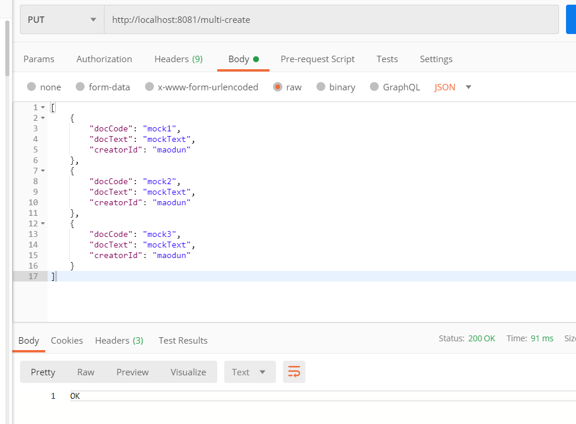

# SpringBoot整合Mongo，整合内嵌Mongo

## 内嵌 Mongo 用于单元测试


## Mongo 
### 不用建表，先配置YAML文件
```yaml
# mongo配置
spring:
  data:
    mongodb:
      uri: mongodb://192.168.15.102:27017
      database: myDB
      username: admin
      password: 123456
      auto-index-creation: on #自动创建索引
      field-naming-strategy: org.springframework.data.mapping.model.SnakeCaseFieldNamingStrategy # 字段映射关系， 如TestDoc映射为testDod表，creatorId映射为creator_id
      # authentication-database: 认证服务器地址
      # grid-fs-database: grid-fs地址

  jackson:
    # 时区，字符串格式化
    time-zone: GMT+8
    date-format: "yyyy-MM-dd HH:mm:ss"
```
### 依次定义Pojo,Dao,Service,Controller
参考代码,SpringData将根据Pojo自动生成对应Mongo表，无须手动建表。

### Create操作
* 插入一个字段
```java
TestDoc testDoc = new TestDoc();
Date time = new Date();
testDoc.setCreateTime(time);
testDoc.setCreatorId("maodun");
testDoc.setDocCode(UUID.randomUUID().toString());
testDoc.setDocText(UUID.randomUUID().toString());
testDocDao.insert(testDoc);
```
* 测试索引是否生效 （docCode是已经存在于表中字段），结果是生效的。   
postman header   
```text
Content-type application/json
```
模拟数据   
```json
{
	"docCode" : "ad45e22b-67f4-4276-8830-ae5ea0a0e7ce",
	"docText": "maodunNumberOne"
}
```


* 插入多个Pojo （通过）    
模拟数据   
```json
[
    {
        "docCode": "mock1",
        "docText": "mockText",
        "creatorId": "maodun"
    },
    {
        "docCode": "mock2",
        "docText": "mockText",
        "creatorId": "maodun"
    },
    {
        "docCode": "mock3",
        "docText": "mockText",
        "creatorId": "maodun"
    }
]
```

```java
    @PutMapping("/multi-create")
    public ResponseEntity createMulti(@RequestBody String multipleJson) throws JsonProcessingException {
        CollectionType collectionType = objectMapper.getTypeFactory().constructCollectionType(List.class, TestDoc.class);
        List<TestDoc> testDocs = (List<TestDoc>) objectMapper.readValue(multipleJson, collectionType);
        List<TestDoc> result = testDocDao.insert(testDocs);
        if (result != null) {
            return ResponseEntity.ok("OK");
        } else {
            return ResponseEntity.badRequest().body("FAILT");
        }
    }
```

  


* [MongoRepository Save和Insert的区别](https://www.cnblogs.com/lanqi/p/8535390.html)   
Save追踪_id主键，并进行已有_id的文档更新，如果没有则插入，而Insert不会执行更新，直接报错。
### 尝试